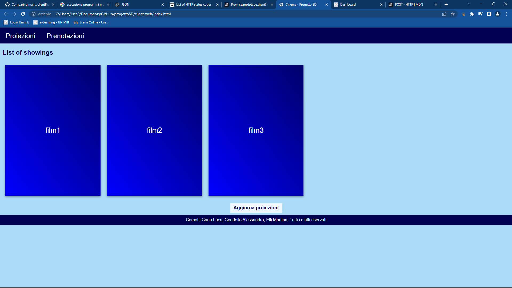
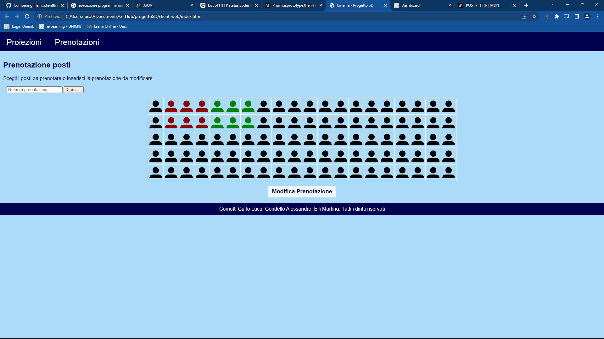

# Progetto Sistemi Distruiti
## Componenti del gruppo
- Alessandro Condello 887918
- Martina Elli 886077
- Carlo Luca Comotti 885885
## Descrizione
Progetto di Sistemi Distribuiti. 
Il testo si può trovare sulla pagine e-learning di Sistemi Distribuiti 2022-2023 nella sezione "Progetto 2023" 
Il lavoro è stato diviso nel seguente modo:
- Alessandro Condello - Database
- Martina Elli - Server Web
- Carlo Luca Comotti - Pagina Web

Foto di come il progetto si mostra:

## Impostare il progetto
Per l'esecuzione del codice, a seconda dell'ide utilizzato, seguire le seguenti istruzioni:
- Intellij IDEA
  1) Aprire il progetto con File -> Open -> Percorso della cartella
  2) Una volta aperto, andare dinuovo in File -> Open -> Percorso della cartella però, sta volta anzichè selezionare progettoSD selezionare database e selezionare "Aprire il progetto in un altra finestra"
  3) Seguire di nuovo il passo 2 però, anzichè "database" selezionare "client-web"
  4) Andare nella finestra database aperta nel passo 2, espandere SRC fino a che non si trova il file "Main"
  5) Aprire il file MAIN e cliccare sulla freccia verde
  6) Seguire il passo 4 e 5 anche per la finestra aperta nel passo 3
  7) Dalla finestra aperta nel passo 1, espandere la cartella "client-web", aprire "index.html", portare il mouse in alto a destra della area di codifica. Appariranno dei simboli rappresentanti vari browser webs, cliccare sul proprio browser web preferito. Il progetto è stato testato su Google Chrome, Firefox e Safari.
- Eclipse
  1) Importazione: file>Open project from file system... e selezionare le cartelle server-web e database;
  2) Configurazione di esecuzione: Run>Run configurations..., inserire la base directory (volendo selezionando il progetto nella workspace, cliccando su "Workspace...") ed inserire nel campo Goals "clean compile exec:java"; applicare e chiudere
  3) Nell'icona di esecuzione, nel menù a tendina selezionare "Organize Favorites", poi "Add..." e quindi selezionare la configurazione appena creata